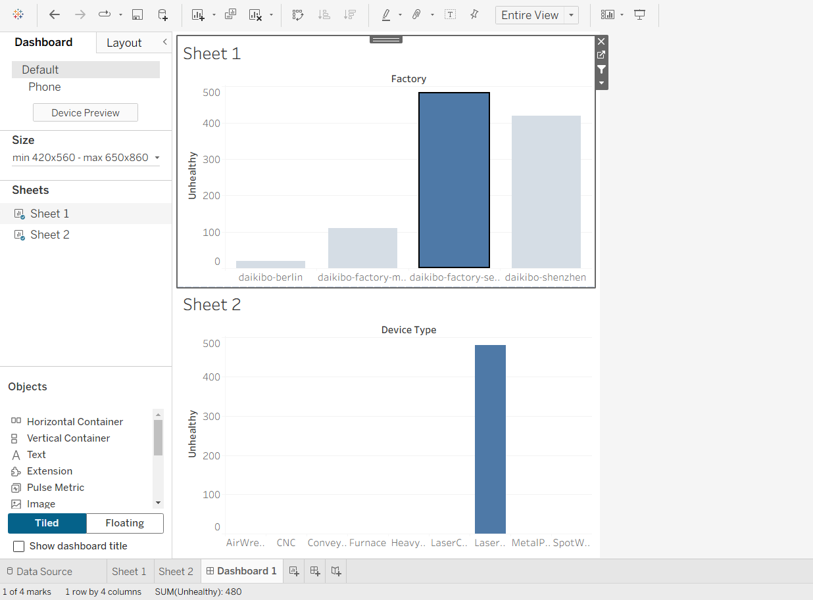

# Deloitte Australia – Data Analytics Virtual Internship (Forage)

This project was completed as part of the **Deloitte Australia Data Analytics and Forensic Technology Virtual Internship** offered by **Forage**. The tasks simulated a real-world consulting environment where I analyzed client transaction data to detect anomalies and build a business dashboard.

## 🔍 Project Overview

- Analyzed financial transaction data using **Excel**  
- Classified records and flagged suspicious entries  
- Built a dashboard in **Tableau** to present key trends and insights  
- Delivered findings in a clear, visual format suitable for business decision-making

## 🛠 Tools & Technologies

- Excel (for data cleaning, classification)  
- Tableau (for interactive dashboard and visual storytelling)  
- Data interpretation & presentation

## 📄 Completion Certificate

[Deloitte Forage Certificate – View PDF](https://forage-uploads-prod.s3.amazonaws.com/completion-certificates/9PBTqmSxAf6zZTseP/io9DzWKe3PTsiS6GG_9PBTqmSxAf6zZTseP_3b2PPD8fbWrrJ7hfQ_1751655869320_completion_certificate.pdf)

---

